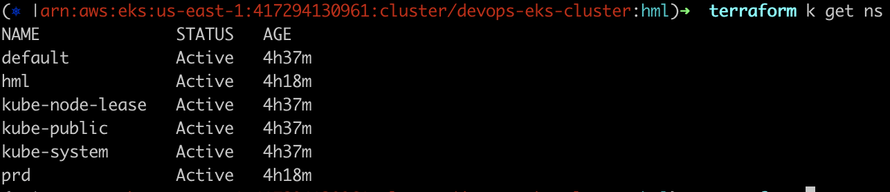
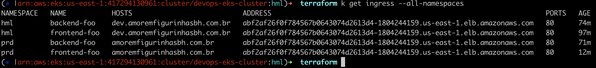
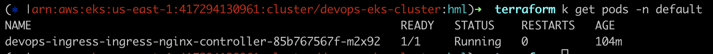
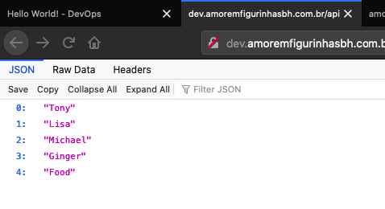
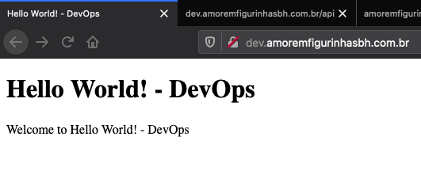
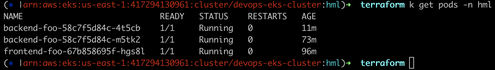
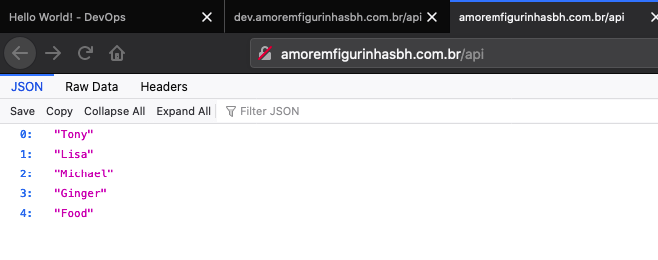
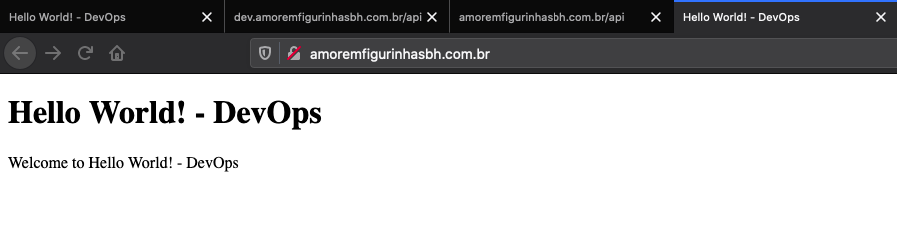
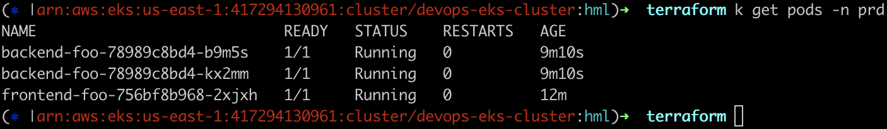

# Descrição

Objetivo: Criar um ambiente utilizando o menor nível de ação interativa/manual possível.

Como a entrega deste desafio solicitou apenas um repositorio no github, realizei a separação dos codigos em branch separadas:

## Branches

| Nome                  |  Descrição                                                                                                                        | Workflow        |
| :-------------------  |  ---------------------------------------------------------------------------------------------                                    | --------        |
| IAC                   |  Responsável pela criação dos recursos como (VPC, EKS, ECR...) utilizando terraform                                               | ci-iac.yml      |
| FRONTEND-FOO          |  Responsável por armazenar o codigo fonte da aplicação frontend-foo e realizar o CI/CD da mesma                                   | ci-frontend.yml |
| FRONTEND-FOO-DEV      |  Simular uma branch qualquer do repositório frontend-foo, caso a estrutura desse desafio fosse separada em mais de um repositório | ci-frontend.yml |
| BACKEND-FOO           |  Responsável por armazenar o codigo fonte da aplicação backend-foo e realizar o CI/CD da mesma                                    | ci-backend.yml  |
| BACKEND-FOO-DEV       |  Simular uma branch qualquer do repositório backend-foo, caso a estrutura desse desafio fosse separada em mais de um repositório  | ci-backend.yml  |

## Requisitos obrigatórios

Para funcionamento correto dessa stack, são necessários a criação / definição do recurso na AWS (EC2 KeyPair), após a execução da pipeline das branches:

-   FRONTEND-FOO-DEV
-   FRONTEND-FOO
-   BACKEND-FOO-DEV
-   BACKEND-FOO

Será retornado o endereço de DNS que você irá precisar configurar em sua zona de DNS.

```
Print loadbalancer endpoint
Run kubectl get svc devops-ingress-ingress-nginx-controller | awk 'NR>1 {print $4}'
abf2af26f0f784567b0643074d2613d4-1804244159.us-east-1.elb.amazonaws.com
```

# Kubernetes

Essa versão cria apenas um cluster Kubernetes utilizando o serviço gerenciado da Amazon AWS o EKS contendo apenas o que é necessário para validar funcionamento da solução. 

Componentes instalados / Configurados:

- Nginx Ingress Controller
- Horizontal pod autoscaler

Componentes importantes não instalados:

- Cert manager (Podendo ser integrado com Let`s Encrypt para fornecer certificado SSL válido)
- Cluster Autoscaler (Responsável por redimensionar o cluster de acordo com a demanda)
- Service Account integration com OIDC / Kiam (Responsável por fornecer uma identidade unica ao POD para acesso aos recursos da AWS)
- Fluxcd (GitOps, possibilitando sincronismo de manifestos yaml diretamente no cluster)
- Grafana (Prover metricas, graficos, dashboards para o cluster)
- Prometheus (Fornecer metricas do cluster) 
- Dashboard (Console administrativa para o cluster)
- Calico (Controle de ACL a nível de POD para garantir melhor segurança dentro do cluster)

# Evidências

## Geral

### Lista de namespaces


### Lista de ingress


### Ingress controller


## Ambiente não produtivo 

### Acesso ao backend



### Acesso ao frontend



### Lista de pods no namespace hml



## Ambiente produtivo 

### Acesso ao backend



### Acesso ao frontend



### Lista de pods no namespace prd


